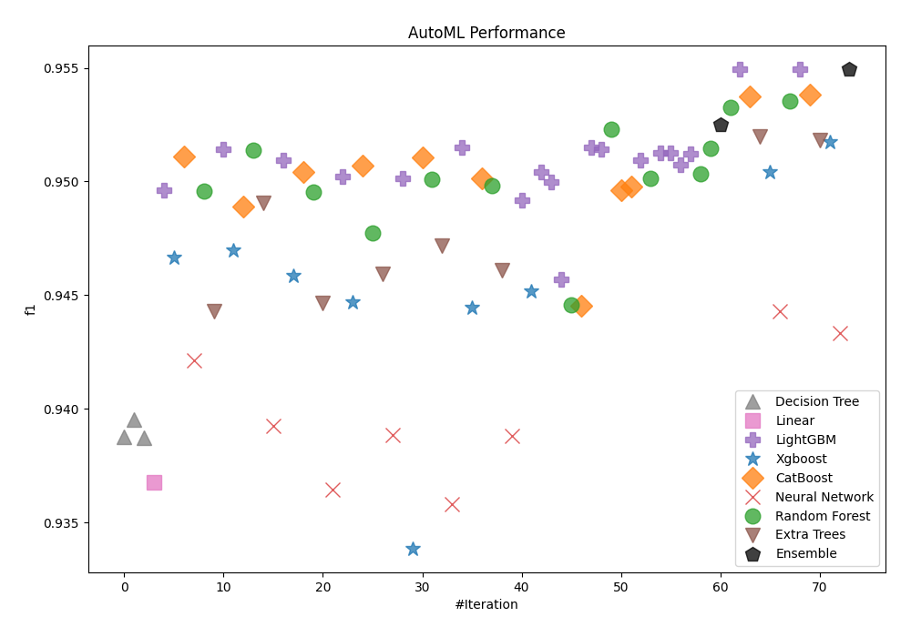
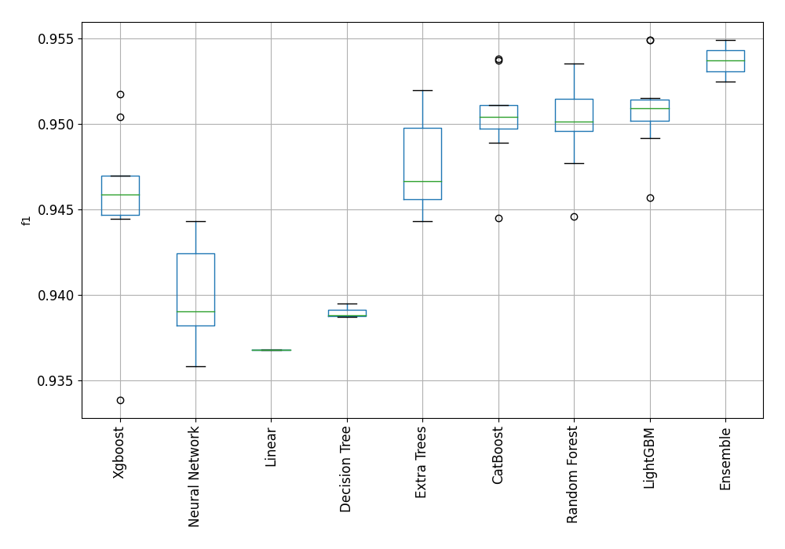
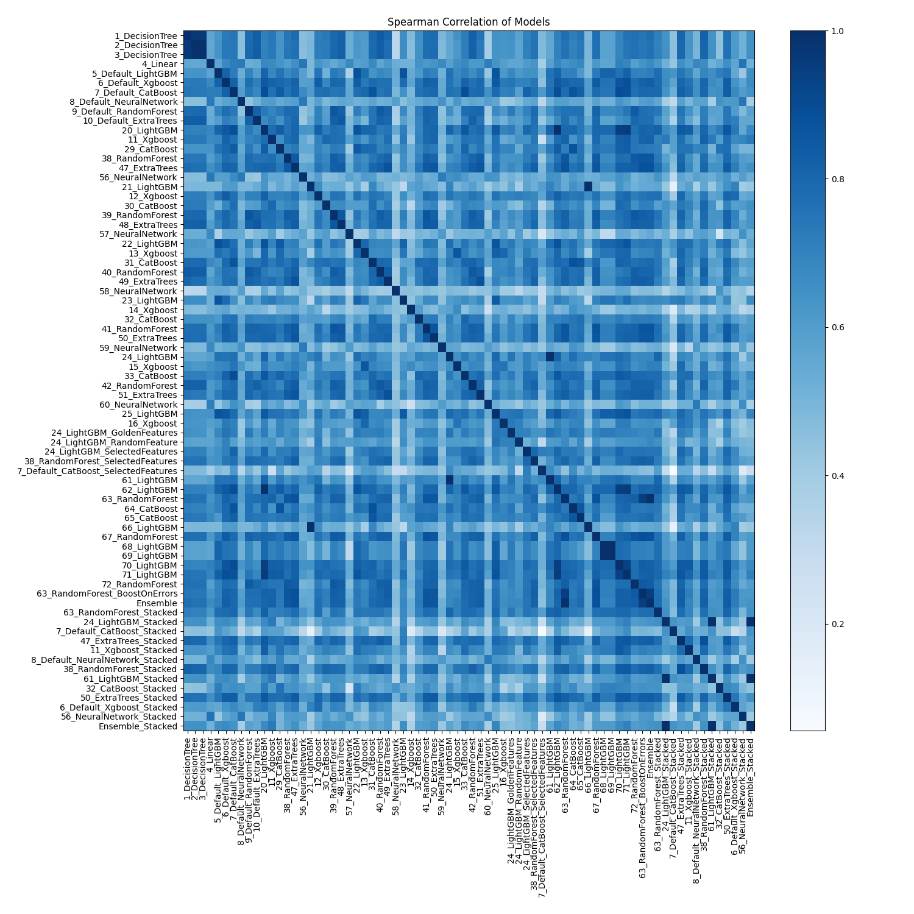

# AutoML Leaderboard

| Best model   | name                                                                                 | model_type     | metric_type   |   metric_value |   train_time |
|:-------------|:-------------------------------------------------------------------------------------|:---------------|:--------------|---------------:|-------------:|
|              | [1_DecisionTree](1_DecisionTree/README.md)                                           | Decision Tree  | f1            |       0.938791 |        23.84 |
|              | [2_DecisionTree](2_DecisionTree/README.md)                                           | Decision Tree  | f1            |       0.939512 |        22.81 |
|              | [3_DecisionTree](3_DecisionTree/README.md)                                           | Decision Tree  | f1            |       0.938722 |        22.63 |
|              | [4_Linear](4_Linear/README.md)                                                       | Linear         | f1            |       0.936775 |        45.65 |
|              | [5_Default_LightGBM](5_Default_LightGBM/README.md)                                   | LightGBM       | f1            |       0.949622 |        44.39 |
|              | [6_Default_Xgboost](6_Default_Xgboost/README.md)                                     | Xgboost        | f1            |       0.946644 |        45.29 |
|              | [7_Default_CatBoost](7_Default_CatBoost/README.md)                                   | CatBoost       | f1            |       0.951098 |        37    |
|              | [8_Default_NeuralNetwork](8_Default_NeuralNetwork/README.md)                         | Neural Network | f1            |       0.94214  |        39.51 |
|              | [9_Default_RandomForest](9_Default_RandomForest/README.md)                           | Random Forest  | f1            |       0.949581 |        47.74 |
|              | [10_Default_ExtraTrees](10_Default_ExtraTrees/README.md)                             | Extra Trees    | f1            |       0.944311 |        40.23 |
|              | [20_LightGBM](20_LightGBM/README.md)                                                 | LightGBM       | f1            |       0.951431 |        37.21 |
|              | [11_Xgboost](11_Xgboost/README.md)                                                   | Xgboost        | f1            |       0.946957 |        43.64 |
|              | [29_CatBoost](29_CatBoost/README.md)                                                 | CatBoost       | f1            |       0.948916 |        73.15 |
|              | [38_RandomForest](38_RandomForest/README.md)                                         | Random Forest  | f1            |       0.951391 |        44.7  |
|              | [47_ExtraTrees](47_ExtraTrees/README.md)                                             | Extra Trees    | f1            |       0.949065 |        45.22 |
|              | [56_NeuralNetwork](56_NeuralNetwork/README.md)                                       | Neural Network | f1            |       0.939247 |        39.43 |
|              | [21_LightGBM](21_LightGBM/README.md)                                                 | LightGBM       | f1            |       0.950923 |        46.44 |
|              | [12_Xgboost](12_Xgboost/README.md)                                                   | Xgboost        | f1            |       0.94586  |        51.51 |
|              | [30_CatBoost](30_CatBoost/README.md)                                                 | CatBoost       | f1            |       0.950433 |        59.92 |
|              | [39_RandomForest](39_RandomForest/README.md)                                         | Random Forest  | f1            |       0.949525 |        52.08 |
|              | [48_ExtraTrees](48_ExtraTrees/README.md)                                             | Extra Trees    | f1            |       0.944641 |        44.79 |
|              | [57_NeuralNetwork](57_NeuralNetwork/README.md)                                       | Neural Network | f1            |       0.936431 |        40.49 |
|              | [22_LightGBM](22_LightGBM/README.md)                                                 | LightGBM       | f1            |       0.950221 |        51.13 |
|              | [13_Xgboost](13_Xgboost/README.md)                                                   | Xgboost        | f1            |       0.944701 |        36    |
|              | [31_CatBoost](31_CatBoost/README.md)                                                 | CatBoost       | f1            |       0.950711 |        42.29 |
|              | [40_RandomForest](40_RandomForest/README.md)                                         | Random Forest  | f1            |       0.947722 |        44.86 |
|              | [49_ExtraTrees](49_ExtraTrees/README.md)                                             | Extra Trees    | f1            |       0.945926 |        41.83 |
|              | [58_NeuralNetwork](58_NeuralNetwork/README.md)                                       | Neural Network | f1            |       0.938836 |        43.13 |
|              | [23_LightGBM](23_LightGBM/README.md)                                                 | LightGBM       | f1            |       0.950129 |        60.58 |
|              | [14_Xgboost](14_Xgboost/README.md)                                                   | Xgboost        | f1            |       0.933862 |        38.86 |
|              | [32_CatBoost](32_CatBoost/README.md)                                                 | CatBoost       | f1            |       0.951075 |        56.81 |
|              | [41_RandomForest](41_RandomForest/README.md)                                         | Random Forest  | f1            |       0.950112 |        47.44 |
|              | [50_ExtraTrees](50_ExtraTrees/README.md)                                             | Extra Trees    | f1            |       0.947192 |        45.26 |
|              | [59_NeuralNetwork](59_NeuralNetwork/README.md)                                       | Neural Network | f1            |       0.935828 |        40.37 |
|              | [24_LightGBM](24_LightGBM/README.md)                                                 | LightGBM       | f1            |       0.951517 |        45.62 |
|              | [15_Xgboost](15_Xgboost/README.md)                                                   | Xgboost        | f1            |       0.944444 |        39.02 |
|              | [33_CatBoost](33_CatBoost/README.md)                                                 | CatBoost       | f1            |       0.95012  |        41.22 |
|              | [42_RandomForest](42_RandomForest/README.md)                                         | Random Forest  | f1            |       0.949833 |        46.16 |
|              | [51_ExtraTrees](51_ExtraTrees/README.md)                                             | Extra Trees    | f1            |       0.946086 |        44.8  |
|              | [60_NeuralNetwork](60_NeuralNetwork/README.md)                                       | Neural Network | f1            |       0.938798 |        43.93 |
|              | [25_LightGBM](25_LightGBM/README.md)                                                 | LightGBM       | f1            |       0.949196 |        73.37 |
|              | [16_Xgboost](16_Xgboost/README.md)                                                   | Xgboost        | f1            |       0.945165 |        42.79 |
|              | [24_LightGBM_GoldenFeatures](24_LightGBM_GoldenFeatures/README.md)                   | LightGBM       | f1            |       0.950407 |       216.22 |
|              | [24_LightGBM_RandomFeature](24_LightGBM_RandomFeature/README.md)                     | LightGBM       | f1            |       0.949991 |       100.35 |
|              | [24_LightGBM_SelectedFeatures](24_LightGBM_SelectedFeatures/README.md)               | LightGBM       | f1            |       0.945676 |        36.29 |
|              | [38_RandomForest_SelectedFeatures](38_RandomForest_SelectedFeatures/README.md)       | Random Forest  | f1            |       0.944579 |        33.66 |
|              | [7_Default_CatBoost_SelectedFeatures](7_Default_CatBoost_SelectedFeatures/README.md) | CatBoost       | f1            |       0.944516 |        28.93 |
|              | [61_LightGBM](61_LightGBM/README.md)                                                 | LightGBM       | f1            |       0.951517 |        48.89 |
|              | [62_LightGBM](62_LightGBM/README.md)                                                 | LightGBM       | f1            |       0.951431 |        43.28 |
|              | [63_RandomForest](63_RandomForest/README.md)                                         | Random Forest  | f1            |       0.952293 |        50.63 |
|              | [64_CatBoost](64_CatBoost/README.md)                                                 | CatBoost       | f1            |       0.949632 |        43.78 |
|              | [65_CatBoost](65_CatBoost/README.md)                                                 | CatBoost       | f1            |       0.949778 |        42.63 |
|              | [66_LightGBM](66_LightGBM/README.md)                                                 | LightGBM       | f1            |       0.950923 |        53.71 |
|              | [67_RandomForest](67_RandomForest/README.md)                                         | Random Forest  | f1            |       0.950149 |        51.61 |
|              | [68_LightGBM](68_LightGBM/README.md)                                                 | LightGBM       | f1            |       0.951269 |        48.45 |
|              | [69_LightGBM](69_LightGBM/README.md)                                                 | LightGBM       | f1            |       0.951269 |        48.62 |
|              | [70_LightGBM](70_LightGBM/README.md)                                                 | LightGBM       | f1            |       0.950729 |        45.77 |
|              | [71_LightGBM](71_LightGBM/README.md)                                                 | LightGBM       | f1            |       0.951238 |        44.02 |
|              | [72_RandomForest](72_RandomForest/README.md)                                         | Random Forest  | f1            |       0.950326 |        50.36 |
|              | [63_RandomForest_BoostOnErrors](63_RandomForest_BoostOnErrors/README.md)             | Random Forest  | f1            |       0.95146  |        55.39 |
|              | [Ensemble](Ensemble/README.md)                                                       | Ensemble       | f1            |       0.952487 |         8.02 |
|              | [63_RandomForest_Stacked](63_RandomForest_Stacked/README.md)                         | Random Forest  | f1            |       0.953264 |        58.63 |
| **the best** | [24_LightGBM_Stacked](24_LightGBM_Stacked/README.md)                                 | LightGBM       | f1            |       0.954925 |        58.31 |
|              | [7_Default_CatBoost_Stacked](7_Default_CatBoost_Stacked/README.md)                   | CatBoost       | f1            |       0.953738 |        42.65 |
|              | [47_ExtraTrees_Stacked](47_ExtraTrees_Stacked/README.md)                             | Extra Trees    | f1            |       0.951975 |        49.55 |
|              | [11_Xgboost_Stacked](11_Xgboost_Stacked/README.md)                                   | Xgboost        | f1            |       0.950418 |        47.97 |
|              | [8_Default_NeuralNetwork_Stacked](8_Default_NeuralNetwork_Stacked/README.md)         | Neural Network | f1            |       0.94431  |        43.84 |
|              | [38_RandomForest_Stacked](38_RandomForest_Stacked/README.md)                         | Random Forest  | f1            |       0.953527 |        55.33 |
|              | [61_LightGBM_Stacked](61_LightGBM_Stacked/README.md)                                 | LightGBM       | f1            |       0.954925 |        58.79 |
|              | [32_CatBoost_Stacked](32_CatBoost_Stacked/README.md)                                 | CatBoost       | f1            |       0.953812 |        67.4  |
|              | [50_ExtraTrees_Stacked](50_ExtraTrees_Stacked/README.md)                             | Extra Trees    | f1            |       0.951834 |        51.84 |
|              | [6_Default_Xgboost_Stacked](6_Default_Xgboost_Stacked/README.md)                     | Xgboost        | f1            |       0.951727 |        52.44 |
|              | [56_NeuralNetwork_Stacked](56_NeuralNetwork_Stacked/README.md)                       | Neural Network | f1            |       0.943319 |        49.33 |
|              | [Ensemble_Stacked](Ensemble_Stacked/README.md)                                       | Ensemble       | f1            |       0.954925 |        10.71 |

### AutoML Performance

### AutoML Performance Boxplot

### Spearman Correlation of Models

