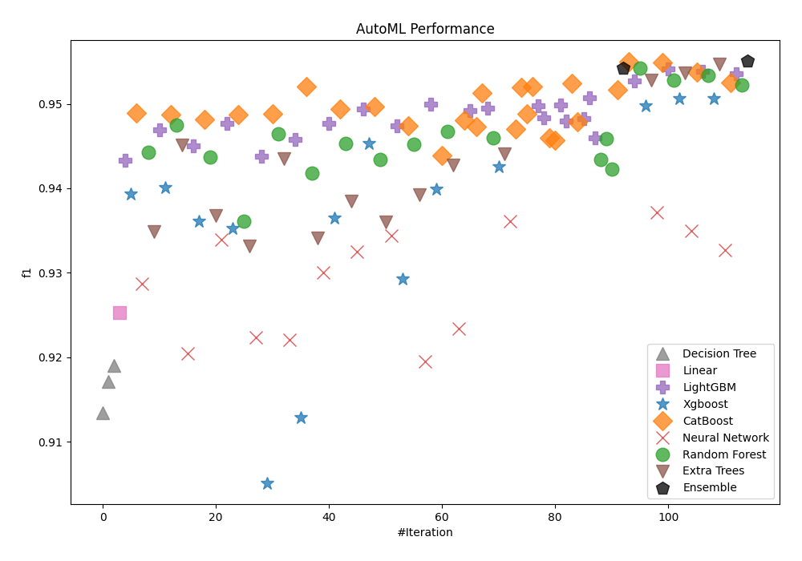
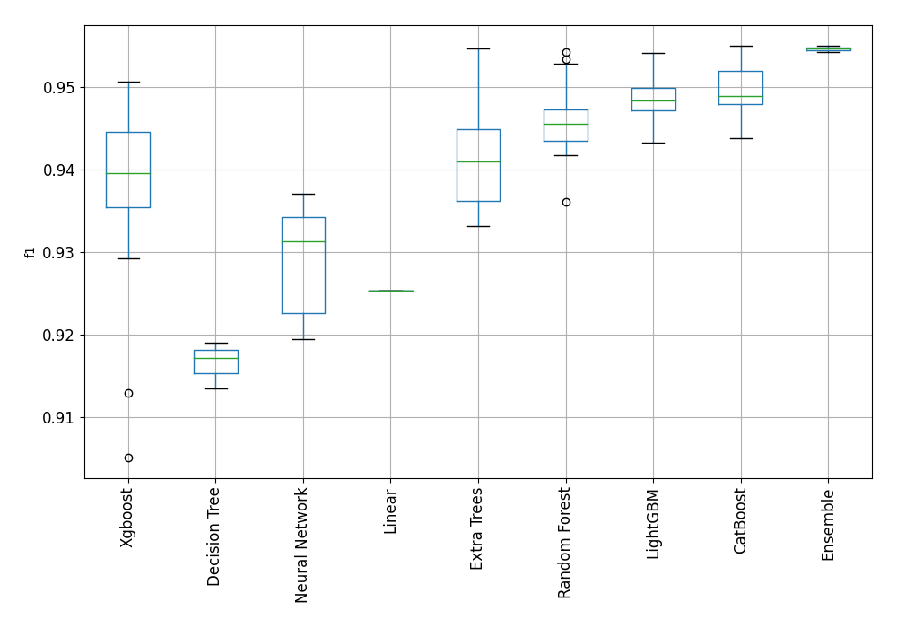
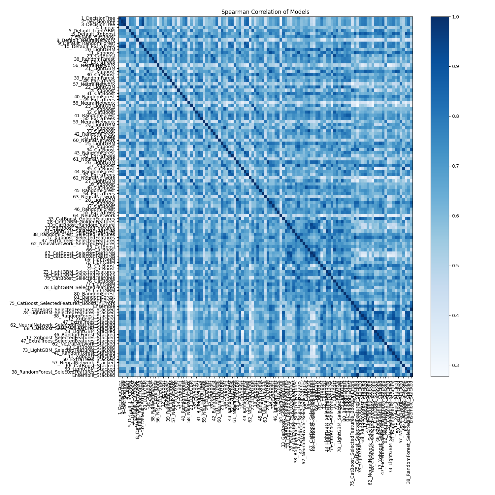

# AutoML Leaderboard

| Best model   | name                                                                                               | model_type     | metric_type   |   metric_value |   train_time |
|:-------------|:---------------------------------------------------------------------------------------------------|:---------------|:--------------|---------------:|-------------:|
|              | [1_DecisionTree](1_DecisionTree/README.md)                                                         | Decision Tree  | f1            |       0.913462 |        19.75 |
|              | [2_DecisionTree](2_DecisionTree/README.md)                                                         | Decision Tree  | f1            |       0.917147 |        17.16 |
|              | [3_DecisionTree](3_DecisionTree/README.md)                                                         | Decision Tree  | f1            |       0.919062 |        17.63 |
|              | [4_Linear](4_Linear/README.md)                                                                     | Linear         | f1            |       0.925333 |        32.78 |
|              | [5_Default_LightGBM](5_Default_LightGBM/README.md)                                                 | LightGBM       | f1            |       0.943315 |        26.83 |
|              | [6_Default_Xgboost](6_Default_Xgboost/README.md)                                                   | Xgboost        | f1            |       0.939314 |        26.9  |
|              | [7_Default_CatBoost](7_Default_CatBoost/README.md)                                                 | CatBoost       | f1            |       0.948918 |        22.13 |
|              | [8_Default_NeuralNetwork](8_Default_NeuralNetwork/README.md)                                       | Neural Network | f1            |       0.928728 |        21.1  |
|              | [9_Default_RandomForest](9_Default_RandomForest/README.md)                                         | Random Forest  | f1            |       0.944248 |        29.01 |
|              | [10_Default_ExtraTrees](10_Default_ExtraTrees/README.md)                                           | Extra Trees    | f1            |       0.934849 |        26.1  |
|              | [20_LightGBM](20_LightGBM/README.md)                                                               | LightGBM       | f1            |       0.94691  |        22.92 |
|              | [11_Xgboost](11_Xgboost/README.md)                                                                 | Xgboost        | f1            |       0.940141 |        24.66 |
|              | [29_CatBoost](29_CatBoost/README.md)                                                               | CatBoost       | f1            |       0.948696 |        38.28 |
|              | [38_RandomForest](38_RandomForest/README.md)                                                       | Random Forest  | f1            |       0.947507 |        28.31 |
|              | [47_ExtraTrees](47_ExtraTrees/README.md)                                                           | Extra Trees    | f1            |       0.94514  |        26.19 |
|              | [56_NeuralNetwork](56_NeuralNetwork/README.md)                                                     | Neural Network | f1            |       0.92048  |        22.17 |
|              | [21_LightGBM](21_LightGBM/README.md)                                                               | LightGBM       | f1            |       0.945026 |        27.49 |
|              | [12_Xgboost](12_Xgboost/README.md)                                                                 | Xgboost        | f1            |       0.936095 |        27.09 |
|              | [30_CatBoost](30_CatBoost/README.md)                                                               | CatBoost       | f1            |       0.948193 |        29.99 |
|              | [39_RandomForest](39_RandomForest/README.md)                                                       | Random Forest  | f1            |       0.943662 |        28.07 |
|              | [48_ExtraTrees](48_ExtraTrees/README.md)                                                           | Extra Trees    | f1            |       0.936787 |        27.53 |
|              | [57_NeuralNetwork](57_NeuralNetwork/README.md)                                                     | Neural Network | f1            |       0.933913 |        24.71 |
|              | [22_LightGBM](22_LightGBM/README.md)                                                               | LightGBM       | f1            |       0.947642 |        27.52 |
|              | [13_Xgboost](13_Xgboost/README.md)                                                                 | Xgboost        | f1            |       0.935221 |        23.36 |
|              | [31_CatBoost](31_CatBoost/README.md)                                                               | CatBoost       | f1            |       0.94874  |        25.83 |
|              | [40_RandomForest](40_RandomForest/README.md)                                                       | Random Forest  | f1            |       0.936132 |        28.57 |
|              | [49_ExtraTrees](49_ExtraTrees/README.md)                                                           | Extra Trees    | f1            |       0.933157 |        29.67 |
|              | [58_NeuralNetwork](58_NeuralNetwork/README.md)                                                     | Neural Network | f1            |       0.922395 |        27.39 |
|              | [23_LightGBM](23_LightGBM/README.md)                                                               | LightGBM       | f1            |       0.943772 |        33.95 |
|              | [14_Xgboost](14_Xgboost/README.md)                                                                 | Xgboost        | f1            |       0.905127 |        22.37 |
|              | [32_CatBoost](32_CatBoost/README.md)                                                               | CatBoost       | f1            |       0.948829 |        28.41 |
|              | [41_RandomForest](41_RandomForest/README.md)                                                       | Random Forest  | f1            |       0.946484 |        33.16 |
|              | [50_ExtraTrees](50_ExtraTrees/README.md)                                                           | Extra Trees    | f1            |       0.943527 |        27.91 |
|              | [59_NeuralNetwork](59_NeuralNetwork/README.md)                                                     | Neural Network | f1            |       0.922049 |        25.59 |
|              | [24_LightGBM](24_LightGBM/README.md)                                                               | LightGBM       | f1            |       0.945817 |        26.13 |
|              | [15_Xgboost](15_Xgboost/README.md)                                                                 | Xgboost        | f1            |       0.912901 |        23.73 |
|              | [33_CatBoost](33_CatBoost/README.md)                                                               | CatBoost       | f1            |       0.95201  |        27.2  |
|              | [42_RandomForest](42_RandomForest/README.md)                                                       | Random Forest  | f1            |       0.941799 |        32.29 |
|              | [51_ExtraTrees](51_ExtraTrees/README.md)                                                           | Extra Trees    | f1            |       0.9341   |        26.93 |
|              | [60_NeuralNetwork](60_NeuralNetwork/README.md)                                                     | Neural Network | f1            |       0.93007  |        25.46 |
|              | [25_LightGBM](25_LightGBM/README.md)                                                               | LightGBM       | f1            |       0.947642 |        30.31 |
|              | [16_Xgboost](16_Xgboost/README.md)                                                                 | Xgboost        | f1            |       0.936446 |        24.16 |
|              | [34_CatBoost](34_CatBoost/README.md)                                                               | CatBoost       | f1            |       0.949416 |        23.17 |
|              | [43_RandomForest](43_RandomForest/README.md)                                                       | Random Forest  | f1            |       0.945326 |        29.99 |
|              | [52_ExtraTrees](52_ExtraTrees/README.md)                                                           | Extra Trees    | f1            |       0.938523 |        29.99 |
|              | [61_NeuralNetwork](61_NeuralNetwork/README.md)                                                     | Neural Network | f1            |       0.932521 |        28.03 |
|              | [26_LightGBM](26_LightGBM/README.md)                                                               | LightGBM       | f1            |       0.949433 |        28.31 |
|              | [17_Xgboost](17_Xgboost/README.md)                                                                 | Xgboost        | f1            |       0.945295 |        29.6  |
|              | [35_CatBoost](35_CatBoost/README.md)                                                               | CatBoost       | f1            |       0.949696 |        39.76 |
|              | [44_RandomForest](44_RandomForest/README.md)                                                       | Random Forest  | f1            |       0.943413 |        34.06 |
|              | [53_ExtraTrees](53_ExtraTrees/README.md)                                                           | Extra Trees    | f1            |       0.936059 |        29.09 |
|              | [62_NeuralNetwork](62_NeuralNetwork/README.md)                                                     | Neural Network | f1            |       0.934383 |        30.81 |
|              | [27_LightGBM](27_LightGBM/README.md)                                                               | LightGBM       | f1            |       0.947368 |        28.65 |
|              | [18_Xgboost](18_Xgboost/README.md)                                                                 | Xgboost        | f1            |       0.929267 |        25.18 |
|              | [36_CatBoost](36_CatBoost/README.md)                                                               | CatBoost       | f1            |       0.947414 |        33.51 |
|              | [45_RandomForest](45_RandomForest/README.md)                                                       | Random Forest  | f1            |       0.945199 |        30.76 |
|              | [54_ExtraTrees](54_ExtraTrees/README.md)                                                           | Extra Trees    | f1            |       0.939222 |        28.97 |
|              | [63_NeuralNetwork](63_NeuralNetwork/README.md)                                                     | Neural Network | f1            |       0.919499 |        28.18 |
|              | [28_LightGBM](28_LightGBM/README.md)                                                               | LightGBM       | f1            |       0.949978 |        26.63 |
|              | [19_Xgboost](19_Xgboost/README.md)                                                                 | Xgboost        | f1            |       0.939886 |        31.88 |
|              | [37_CatBoost](37_CatBoost/README.md)                                                               | CatBoost       | f1            |       0.943849 |        30.88 |
|              | [46_RandomForest](46_RandomForest/README.md)                                                       | Random Forest  | f1            |       0.946766 |        31.65 |
|              | [55_ExtraTrees](55_ExtraTrees/README.md)                                                           | Extra Trees    | f1            |       0.94277  |        32.04 |
|              | [64_NeuralNetwork](64_NeuralNetwork/README.md)                                                     | Neural Network | f1            |       0.923417 |        28.04 |
|              | [33_CatBoost_GoldenFeatures](33_CatBoost_GoldenFeatures/README.md)                                 | CatBoost       | f1            |       0.948063 |       181.21 |
|              | [28_LightGBM_GoldenFeatures](28_LightGBM_GoldenFeatures/README.md)                                 | LightGBM       | f1            |       0.949241 |        31.28 |
|              | [33_CatBoost_RandomFeature](33_CatBoost_RandomFeature/README.md)                                   | CatBoost       | f1            |       0.947323 |       123.2  |
|              | [33_CatBoost_SelectedFeatures](33_CatBoost_SelectedFeatures/README.md)                             | CatBoost       | f1            |       0.951262 |        23.11 |
|              | [28_LightGBM_SelectedFeatures](28_LightGBM_SelectedFeatures/README.md)                             | LightGBM       | f1            |       0.949521 |        25.78 |
|              | [38_RandomForest_SelectedFeatures](38_RandomForest_SelectedFeatures/README.md)                     | Random Forest  | f1            |       0.945958 |        25.56 |
|              | [17_Xgboost_SelectedFeatures](17_Xgboost_SelectedFeatures/README.md)                               | Xgboost        | f1            |       0.942569 |        27.6  |
|              | [47_ExtraTrees_SelectedFeatures](47_ExtraTrees_SelectedFeatures/README.md)                         | Extra Trees    | f1            |       0.944062 |        25.11 |
|              | [62_NeuralNetwork_SelectedFeatures](62_NeuralNetwork_SelectedFeatures/README.md)                   | Neural Network | f1            |       0.936095 |        23.57 |
|              | [65_CatBoost](65_CatBoost/README.md)                                                               | CatBoost       | f1            |       0.947003 |        25.99 |
|              | [66_CatBoost](66_CatBoost/README.md)                                                               | CatBoost       | f1            |       0.951927 |        31    |
|              | [67_CatBoost_SelectedFeatures](67_CatBoost_SelectedFeatures/README.md)                             | CatBoost       | f1            |       0.948785 |        22.97 |
|              | [68_CatBoost_SelectedFeatures](68_CatBoost_SelectedFeatures/README.md)                             | CatBoost       | f1            |       0.952091 |        23.07 |
|              | [69_LightGBM](69_LightGBM/README.md)                                                               | LightGBM       | f1            |       0.94976  |        37.88 |
|              | [70_LightGBM](70_LightGBM/README.md)                                                               | LightGBM       | f1            |       0.948328 |        34.2  |
|              | [71_CatBoost](71_CatBoost/README.md)                                                               | CatBoost       | f1            |       0.946004 |        31.59 |
|              | [72_CatBoost](72_CatBoost/README.md)                                                               | CatBoost       | f1            |       0.94569  |        45.65 |
|              | [73_LightGBM_SelectedFeatures](73_LightGBM_SelectedFeatures/README.md)                             | LightGBM       | f1            |       0.949891 |        27.44 |
|              | [74_LightGBM_SelectedFeatures](74_LightGBM_SelectedFeatures/README.md)                             | LightGBM       | f1            |       0.948012 |        27.33 |
|              | [75_CatBoost_SelectedFeatures](75_CatBoost_SelectedFeatures/README.md)                             | CatBoost       | f1            |       0.952464 |        25.19 |
|              | [76_CatBoost](76_CatBoost/README.md)                                                               | CatBoost       | f1            |       0.947871 |        37.68 |
|              | [77_LightGBM](77_LightGBM/README.md)                                                               | LightGBM       | f1            |       0.948283 |        27.87 |
|              | [78_LightGBM_SelectedFeatures](78_LightGBM_SelectedFeatures/README.md)                             | LightGBM       | f1            |       0.95072  |        29.18 |
|              | [79_LightGBM](79_LightGBM/README.md)                                                               | LightGBM       | f1            |       0.946004 |        29.37 |
|              | [80_RandomForest](80_RandomForest/README.md)                                                       | Random Forest  | f1            |       0.943413 |        34.81 |
|              | [81_RandomForest](81_RandomForest/README.md)                                                       | Random Forest  | f1            |       0.945839 |        37.05 |
|              | [82_RandomForest](82_RandomForest/README.md)                                                       | Random Forest  | f1            |       0.942265 |        36.63 |
|              | [75_CatBoost_SelectedFeatures_BoostOnErrors](75_CatBoost_SelectedFeatures_BoostOnErrors/README.md) | CatBoost       | f1            |       0.951676 |        26.03 |
|              | [Ensemble](Ensemble/README.md)                                                                     | Ensemble       | f1            |       0.954248 |        13.57 |
|              | [75_CatBoost_SelectedFeatures_Stacked](75_CatBoost_SelectedFeatures_Stacked/README.md)             | CatBoost       | f1            |       0.955002 |        34.31 |
|              | [78_LightGBM_SelectedFeatures_Stacked](78_LightGBM_SelectedFeatures_Stacked/README.md)             | LightGBM       | f1            |       0.952752 |        29.26 |
|              | [38_RandomForest_Stacked](38_RandomForest_Stacked/README.md)                                       | Random Forest  | f1            |       0.954208 |        34.95 |
|              | [17_Xgboost_Stacked](17_Xgboost_Stacked/README.md)                                                 | Xgboost        | f1            |       0.94976  |        30.77 |
|              | [47_ExtraTrees_Stacked](47_ExtraTrees_Stacked/README.md)                                           | Extra Trees    | f1            |       0.952838 |        33.85 |
|              | [62_NeuralNetwork_SelectedFeatures_Stacked](62_NeuralNetwork_SelectedFeatures_Stacked/README.md)   | Neural Network | f1            |       0.937118 |        26.65 |
|              | [68_CatBoost_SelectedFeatures_Stacked](68_CatBoost_SelectedFeatures_Stacked/README.md)             | CatBoost       | f1            |       0.954844 |        29.89 |
|              | [28_LightGBM_Stacked](28_LightGBM_Stacked/README.md)                                               | LightGBM       | f1            |       0.954113 |        31.78 |
|              | [46_RandomForest_Stacked](46_RandomForest_Stacked/README.md)                                       | Random Forest  | f1            |       0.952797 |        39.04 |
|              | [17_Xgboost_SelectedFeatures_Stacked](17_Xgboost_SelectedFeatures_Stacked/README.md)               | Xgboost        | f1            |       0.950633 |        29.62 |
|              | [47_ExtraTrees_SelectedFeatures_Stacked](47_ExtraTrees_SelectedFeatures_Stacked/README.md)         | Extra Trees    | f1            |       0.953671 |        28.68 |
|              | [62_NeuralNetwork_Stacked](62_NeuralNetwork_Stacked/README.md)                                     | Neural Network | f1            |       0.934963 |        28.95 |
|              | [33_CatBoost_Stacked](33_CatBoost_Stacked/README.md)                                               | CatBoost       | f1            |       0.953752 |        31.81 |
|              | [73_LightGBM_SelectedFeatures_Stacked](73_LightGBM_SelectedFeatures_Stacked/README.md)             | LightGBM       | f1            |       0.953833 |        29.7  |
|              | [41_RandomForest_Stacked](41_RandomForest_Stacked/README.md)                                       | Random Forest  | f1            |       0.953336 |        37.54 |
|              | [11_Xgboost_Stacked](11_Xgboost_Stacked/README.md)                                                 | Xgboost        | f1            |       0.95059  |        39.11 |
|              | [50_ExtraTrees_Stacked](50_ExtraTrees_Stacked/README.md)                                           | Extra Trees    | f1            |       0.954664 |        34.82 |
|              | [57_NeuralNetwork_Stacked](57_NeuralNetwork_Stacked/README.md)                                     | Neural Network | f1            |       0.932688 |        29.44 |
|              | [66_CatBoost_Stacked](66_CatBoost_Stacked/README.md)                                               | CatBoost       | f1            |       0.952505 |        39.61 |
|              | [69_LightGBM_Stacked](69_LightGBM_Stacked/README.md)                                               | LightGBM       | f1            |       0.953539 |        34.3  |
|              | [38_RandomForest_SelectedFeatures_Stacked](38_RandomForest_SelectedFeatures_Stacked/README.md)     | Random Forest  | f1            |       0.952215 |        31.91 |
| **the best** | [Ensemble_Stacked](Ensemble_Stacked/README.md)                                                     | Ensemble       | f1            |       0.955041 |        19.72 |

### AutoML Performance

### AutoML Performance Boxplot

### Spearman Correlation of Models

