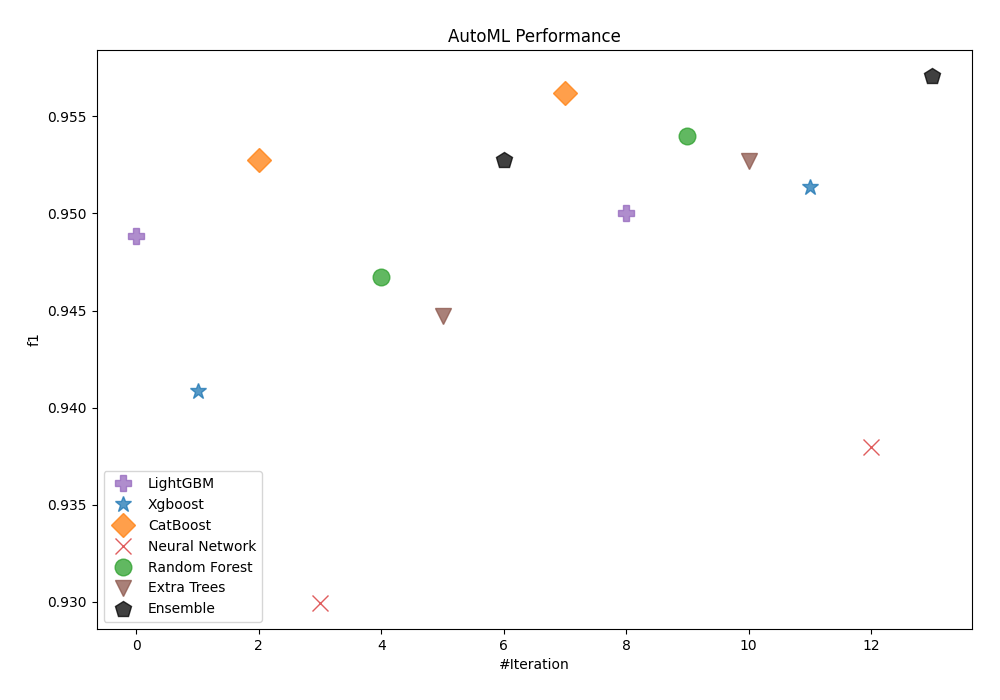
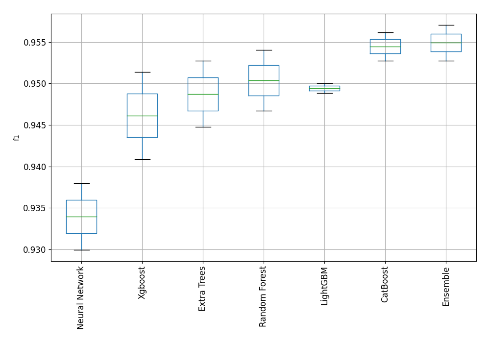
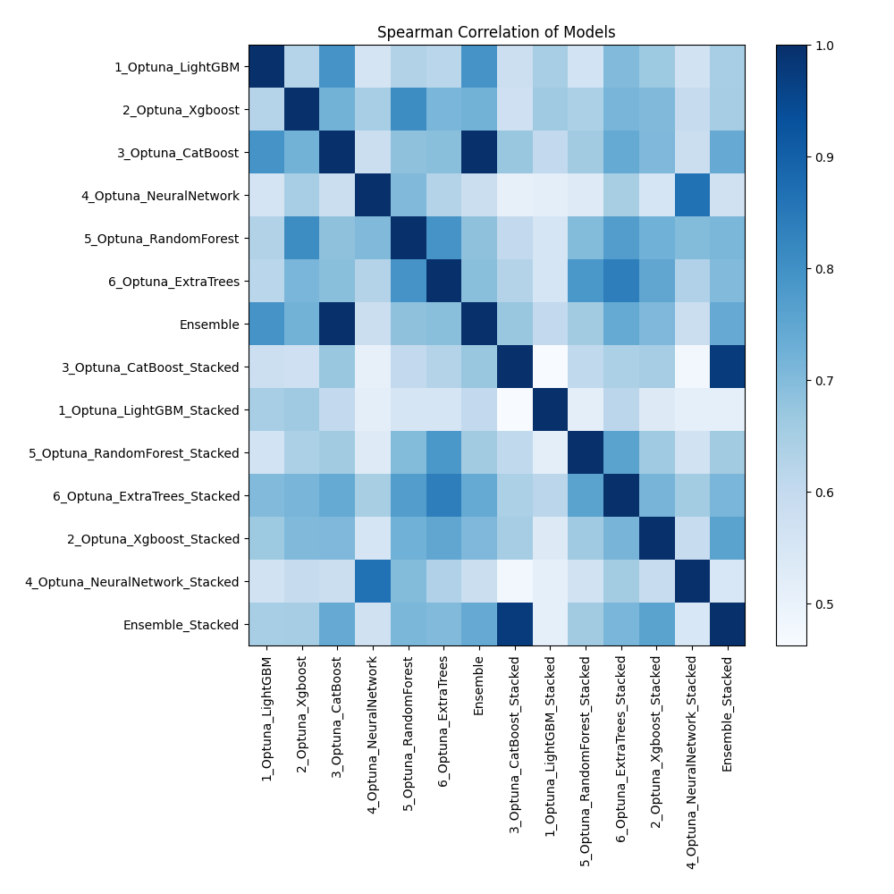

# AutoML Leaderboard

| Best model   | name                                                                       | model_type     | metric_type   |   metric_value |   train_time |
|:-------------|:---------------------------------------------------------------------------|:---------------|:--------------|---------------:|-------------:|
|              | [1_Optuna_LightGBM](1_Optuna_LightGBM/README.md)                           | LightGBM       | f1            |       0.948817 |       113.35 |
|              | [2_Optuna_Xgboost](2_Optuna_Xgboost/README.md)                             | Xgboost        | f1            |       0.940874 |        63.62 |
|              | [3_Optuna_CatBoost](3_Optuna_CatBoost/README.md)                           | CatBoost       | f1            |       0.952756 |        86.46 |
|              | [4_Optuna_NeuralNetwork](4_Optuna_NeuralNetwork/README.md)                 | Neural Network | f1            |       0.929965 |        65.45 |
|              | [5_Optuna_RandomForest](5_Optuna_RandomForest/README.md)                   | Random Forest  | f1            |       0.946735 |        70.37 |
|              | [6_Optuna_ExtraTrees](6_Optuna_ExtraTrees/README.md)                       | Extra Trees    | f1            |       0.944737 |        66.07 |
|              | [Ensemble](Ensemble/README.md)                                             | Ensemble       | f1            |       0.952756 |         1.89 |
|              | [3_Optuna_CatBoost_Stacked](3_Optuna_CatBoost_Stacked/README.md)           | CatBoost       | f1            |       0.956179 |        72.1  |
|              | [1_Optuna_LightGBM_Stacked](1_Optuna_LightGBM_Stacked/README.md)           | LightGBM       | f1            |       0.950043 |       103.76 |
|              | [5_Optuna_RandomForest_Stacked](5_Optuna_RandomForest_Stacked/README.md)   | Random Forest  | f1            |       0.954008 |        64.91 |
|              | [6_Optuna_ExtraTrees_Stacked](6_Optuna_ExtraTrees_Stacked/README.md)       | Extra Trees    | f1            |       0.952715 |        66.19 |
|              | [2_Optuna_Xgboost_Stacked](2_Optuna_Xgboost_Stacked/README.md)             | Xgboost        | f1            |       0.95138  |        63.94 |
|              | [4_Optuna_NeuralNetwork_Stacked](4_Optuna_NeuralNetwork_Stacked/README.md) | Neural Network | f1            |       0.937998 |        73.28 |
| **the best** | [Ensemble_Stacked](Ensemble_Stacked/README.md)                             | Ensemble       | f1            |       0.957055 |         2.15 |

### AutoML Performance

### AutoML Performance Boxplot

### Spearman Correlation of Models

